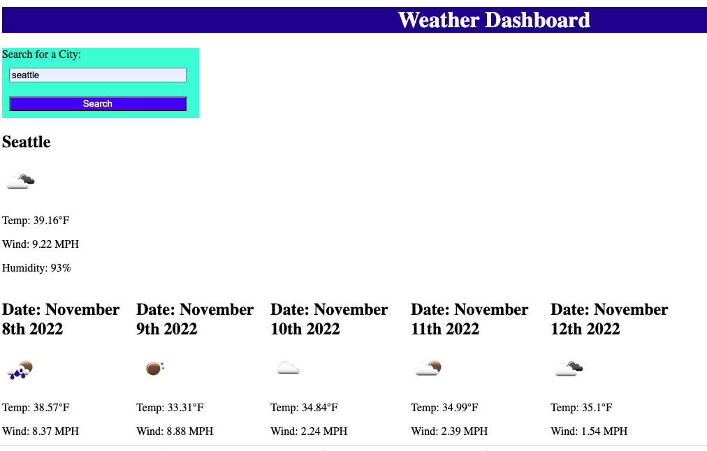

# weather-dashboard

Description: This application uses javascript to generate an interactive weather app. The user types in a city, and the web page displays current and forecasted weather in that city for the next five days, along with a descriptive icon.

Installation: N/A

Usage: Please visit this link: https://clairebain3.github.io/weather-dashboard/

Credits N/A

License Please refer to the license in the repo

